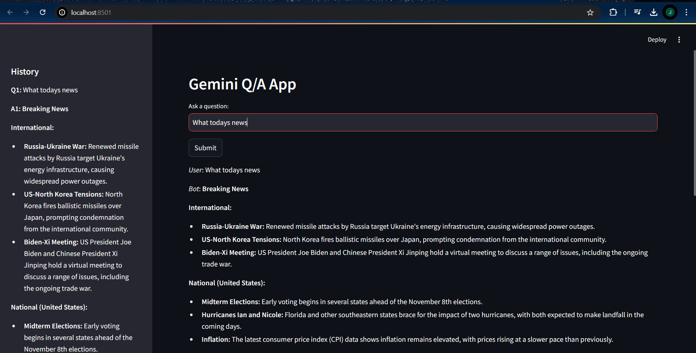

# AI Chatbot using Gemini Pro



## Overview

The **AI Chatbot using Gemini Pro** is an interactive web application that allows users to ask questions and receive answers generated by the Gemini Pro model from Google's Generative AI. This project leverages Streamlit for the user interface and provides a seamless experience for interacting with advanced AI technology.

## Features

- **Interactive Q&A**: Ask questions and get responses from the Gemini Pro model.
- **Session History**: Keep track of the conversation history in the sidebar.
- **User-Friendly Interface**: Built with Streamlit for a smooth and interactive experience.

## Installation

### Prerequisites

- Python 3.7 or later
- Virtual environment (recommended)
- API key for Google Generative AI

### Steps

1. **Clone the Repository:**

    ```bash
    git clone https://github.com/your-github-username/ai-chatbot-gemini.git
    cd ai-chatbot-gemini
    ```

2. **Create and Activate a Virtual Environment:**

    ```bash
    python -m venv venv
    source venv/bin/activate   # On Windows use `venv\Scripts\activate`
    ```

3. **Install the Required Packages:**

    ```bash
    pip install -r requirements.txt
    ```

4. **Set Up Environment Variables:**

    Create a `.env` file in the project root and add your Google API key:

    ```env
    GOOGLE_API_KEY=your_google_api_key
    ```

5. **Run the Application:**

    ```bash
    streamlit run app.py
    ```

## Usage

1. Open the web interface in your browser.
2. Enter a question in the text input field.
3. Click the "Submit" button to get a response from the Gemini Pro model.
4. View the interaction history in the sidebar.

## Project Structure

```plaintext
ai-chatbot-gemini/
├── .env.example
├── .gitignore
├── README.md
├── app.py
├── requirements.txt
└── Image.png
```

- **`app.py`**: Main application file.
- **`requirements.txt`**: List of required Python packages.
- **`assets/`**: Directory for storing images and demo GIFs.

## Technologies Used

- **Streamlit**: Interactive web interface
- **Google Generative AI**: Advanced AI model for generating responses

## Contributing

Contributions are welcome! Please fork the repository and create a pull request with your changes.

1. Fork the Project
2. Create your Feature Branch (`git checkout -b feature/AmazingFeature`)
3. Commit your Changes (`git commit -m 'Add some AmazingFeature'`)
4. Push to the Branch (`git push origin feature/AmazingFeature`)
5. Open a Pull Request

## License

This project is licensed under the MIT License. See the [LICENSE](LICENSE) file for details.

## Contact

- **Name**: Jatin khetan
- **Email**: khetanjatin12@gmail.com

---

Make sure to replace the placeholder paths with the actual paths to your assets and customize any other details as necessary.
